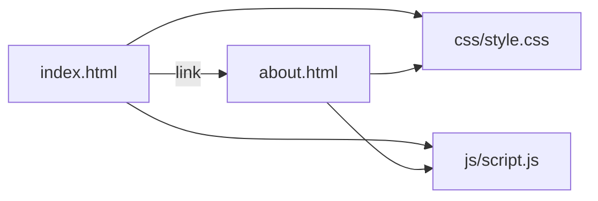

# Documento de Arquitetura

**Projeto:** About Me — Git Lab
**Item de configuração:** ARQ-001
**Versão:** 1.0 · 31/08/2026
**Autor:** Equipe da Aplicação

---

## 1. Visão geral

Aplicação web estática, sem backend e sem dependências externas. Roda apenas abrindo `index.html` no navegador.

## 2. Componentes



| Componente | Responsabilidade |
|---|---|
| `index.html` | Página inicial e navegação |
| `about.html` | Página de perfil acadêmico (item de configuração alterado na US-104) |
| `css/style.css` | Estilo visual compartilhado entre as páginas |
| `js/script.js` | Comportamento simples (ano atual no rodapé) |

## 3. Decisões de arquitetura

| Decisão | Justificativa |
|---|---|
| Aplicação 100% estática (HTML/CSS/JS) | Elimina dependência de instalação (Node, banco de dados) para a atividade em sala |
| Um único arquivo alterado por mudança (`about.html`) | Mantém o exemplo de controle de mudança simples e objetivo |
| Estilo centralizado em `style.css` | Garante que a personalização não quebre o padrão visual (RNF01) |

## 4. Diagrama de pastas

```
about-me-git-lab/
├── index.html
├── about.html        ← item de configuração desta mudança
├── css/style.css
├── js/script.js
├── README.md
└── .gitignore
```

> Documento de exemplo, criado para fins didáticos da atividade de Gerência de Configuração, Git e GitHub.
